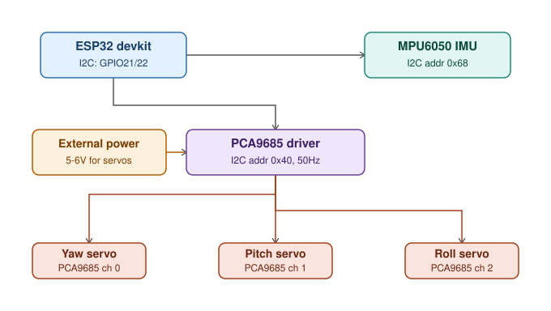

# ESP32 3-Axis Gimbal Stabilizer (MPU6050 + PCA9685)

A hardware-oriented vision platform designed to connect with different AI detection systems and convert live video into useful real-time data.

- 📷 **ESP32-CAM AI-Thinker** — Live video streaming
- ⚙️ **ESP32 + PCA9685** — Gimbal control
- 🔄 **3 Servo Motors** — 3-DOF stabilization

It is designed to be mountable on UAVs, drones, rovers, and other mobile platforms, with applications ranging from person/object detection and road inspection to surveillance and monitoring. Built with affordable hardware, but designed with modularity and scalability in mind.

This project brought together interests in Robotics, Embedded Systems, Computer Vision, and AI. 🤖

A self-stabilizing 3-axis camera/sensor gimbal built on an ESP32, using an MPU6050 IMU for orientation sensing and a PCA9685 PWM driver to control three servos (yaw, pitch, roll). Ported from an original Arduino Uno + Servo.h sketch to run on ESP32 with I2C-driven servo control.

## Purpose

Gimbals mechanically counteract unwanted motion so a mounted camera or sensor stays level and steady. This project reads real-time orientation data (yaw/pitch/roll) from an MPU6050's onboard DMP (Digital Motion Processor), and drives three servos through a PCA9685 to hold the platform stable. Moving to ESP32 + PCA9685 frees up GPIO pins, offloads precise PWM timing to dedicated hardware, and leaves room to add Wi-Fi/Bluetooth control later.

## Hardware

- ESP32 DevKit (any variant with exposed I2C pins)
- MPU6050 6-axis IMU
- PCA9685 16-channel PWM/servo driver
- 3x analog servos (yaw, pitch, roll)
- External 5–6V power supply for the servos (separate from ESP32's own supply)

## Circuit Diagram

### Wiring

**ESP32 ↔ MPU6050**
| ESP32 | MPU6050 |
|---|---|
| 3.3V | VCC |
| GND | GND |
| GPIO 21 | SDA |
| GPIO 22 | SCL |
| GPIO 4 | INT |

**ESP32 ↔ PCA9685**
| ESP32 | PCA9685 |
|---|---|
| 3.3V/5V | VCC (logic) |
| GND | GND |
| GPIO 21 | SDA |
| GPIO 22 | SCL |

**External supply ↔ PCA9685**
| Supply | PCA9685 |
|---|---|
| + (5–6V) | V+ |
| − | GND |

**PCA9685 ↔ Servos**
| Servo | Channel |
|---|---|
| Yaw | 0 |
| Pitch | 1 |
| Roll | 2 |

ESP32-CAM connections — add:

 ESP32-CAM power — Connect directly to 5V of the power supply (not through the ESP32/PCA9685 3.3V line), with GND common to the rest of the circuit.

> **Common ground:** ESP32 GND, PCA9685 GND, and the external supply's GND must all be tied together, or the I2C/PWM signals have no shared reference.

## Libraries Required

Install via Arduino IDE Library Manager:
- `Adafruit PWM Servo Driver Library`
- `I2Cdevlib` (I2Cdev + MPU6050 DMP libraries)

## How It Works

1. MPU6050's DMP computes quaternion-based orientation and outputs yaw/pitch/roll.
2. ESP32 reads this over I2C, triggered by the MPU6050's INT pin.
3. Orientation angles are mapped to servo angles (0–180°).
4. Angles are converted to PCA9685 PWM tick values and sent over I2C to drive the three servos.

## Setup

1. Wire the components as shown in the circuit diagram above.
2. Open `ESP32_Gimbal_PCA9685.ino` in Arduino IDE.
3. Install the required libraries.
4. Run a gyro calibration sketch once and update the offset values (`setXGyroOffset`, etc.) in the code.
5. Upload to the ESP32.
6. Power the PCA9685's V+ rail from the external 5–6V supply.
7. Open Serial Monitor at 115200 baud to confirm `DMP ready!` prints, then move the board to see the servos react.

## Demo Video

www.linkedin.com/in/byteofvivek

## Author

**Vivek Vishwakarma**
Built and maintained by me — combining robotics, embedded systems, and computer vision.

